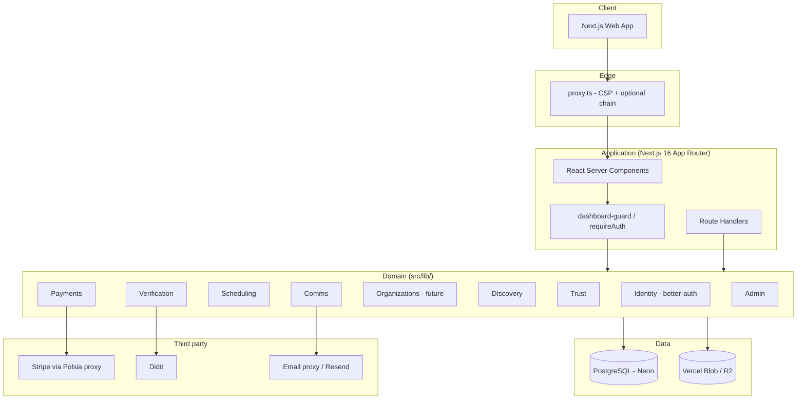

# DriveLinkUp — System Architecture

Authoritative ADRs: [ADR-001 Sweden-first](decisions/ADR-001-sweden-first.md) ·
[ADR-002 better-auth](decisions/ADR-002-better-auth.md).

## Contents

- [1. Product summary](#1-product-summary)
- [2. Architecture principles](#2-architecture-principles)
- [3. High-level architecture](#3-high-level-architecture)
- [4. Bounded contexts](#4-bounded-contexts)
- [5. Tech stack](#5-tech-stack)
- [6. Core data model](#6-core-data-model)
- [7. Key flows](#7-key-flows)
- [8. Third-party integrations](#8-third-party-integrations)
- [9. Security & compliance](#9-security--compliance)
- [10. Infra & deployment](#10-infra--deployment)
- [11. Observability](#11-observability)
- [12. Build phases](#12-build-phases)
- [13. What to give the agent](#13-what-to-give-the-agent)

## 1. Product summary

A Sweden-first marketplace connecting learners (16+) with certified driving
instructors, driving schools, and handledare (adult supervisors in a
Trafikverket-oriented övningskörning arrangement). Learners browse freely,
complete verification, book lessons, and pay in **SEK**. Instructors are
certified; schools list as authorized schools. Handledare is a distinct
marketplace role with enrollment / clickwrap obligations — **not** parental
guardian consent.

Hard constraints:

- Learners under 18 may need handledare enrollment / supervision arrangements
  where product rules require it (see verification flow).
- Instructor/school operation is gated on regulatory verification that expires
  (licence, insurance docs as those ship).
- Fee model today is flat: **0% learner fee, 10% instructor commission (SEK)**.
  School payout splits wait until Organizations exist.
- Reconcile in place on the existing Polsia/Next app — do not greenfield-replace
  `Booking`, auth, or dashboard routes.

## 2. Architecture principles

- **Verification is server-authoritative.** Didit webhooks (and documented
  writers) are the only writers of verified identity/DOB. Client never self-gates
  booking eligibility.
- **State is derived where possible.** `resolveLearnerState()` resolves from
  facts (claimed DOB, verified DOB, Didit decision, handledare enrollment).
- **Money moves through Stripe / Polsia billing.** No custom ledgers. Fee math
  lives in one module (`src/lib/business/booking-fees.ts` today).
- **Everything that expires has a cron** (licence docs, handledare tokens,
  verification sessions) as those features ship.
- **Idempotency everywhere.** Webhooks, payouts, emails — assume retries.
- **No cross-context DB writes.** Call the owning service under `src/lib/<context>/`.

## 3. High-level architecture



## 4. Bounded contexts

| Context | Responsibility | Service root | Owns (target) |
| --- | --- | --- | --- |
| Identity & Auth | Users, sessions, admin role | `src/lib/auth*.ts` → `src/lib/identity/` | better-auth `User`, `Session`, `Account`; marketplace role on `UserProfile` |
| Verification | Age, Didit, handledare enrollment, instructor licence | `src/lib/verification/` | verification state, `HandledareEnrollment`, licence rows |
| Organizations | Schools, memberships | `src/lib/orgs/` | **Not started** |
| Discovery | Search, geo, profiles | `src/lib/discovery/` | Instructor listings (Prisma today) |
| Scheduling | Availability, bookings | `src/lib/scheduling/` | `AvailabilitySlot`, `Booking` |
| Payments | Charges, receipts, fees | `src/lib/payments/` + `booking-fees.ts` | Booking payment fields, receipts |
| Trust | Reviews, disputes | `src/lib/trust/` | `Review`, `Dispute` |
| Comms | Email, messaging | `src/lib/email/` → `src/lib/comms/` | notifications, conversations |
| Admin | Ops queues | `src/lib/admin-guard.ts` → `src/lib/admin/` | admin APIs |

Each context exposes services under `src/lib/<context>/`. Route handlers import
services — not foreign models for writes.

## 5. Tech stack

| Layer | Choice | Why |
| --- | --- | --- |
| Framework | Next.js 16 App Router | RSC + route handlers; `proxy.ts` replaces middleware |
| Language | TypeScript strict | Money + identity |
| Auth | **better-auth** (ADR-002) | Already shipped; Prisma adapter + admin plugin |
| ORM | Prisma (multi-file `prisma/schema/`) | Live Neon schema |
| DB | PostgreSQL (Neon) | Bookings, exclusion constraints |
| Files | Vercel Blob / R2 | Photos, licences |
| Payments | Stripe via Polsia app-payments proxy | Checkout + escrow-style release today |
| KYC/Age | Didit | Age estimation now; ID workflow as verification hardens |
| Email | Polsia email proxy | Transactional mail |
| Hosting | Vercel + Neon | Current deploy |

## 6. Core data model

Live schema is the source of truth under `prisma/schema/`. Below is the
**target shape** while reconciling — prefer extending existing models.

### User (better-auth) + UserProfile (marketplace)

- `User` — framework auth row (`user` / `admin` via admin plugin).
- `UserProfile` — marketplace: `role` = `STUDENT` \| `INSTRUCTOR` \| `HANDLEDARE`,
  signup path, claimed `dateOfBirth`, school fields, Didit estimate fields.
- Do not overload better-auth `User.role` with marketplace roles.

### Verification (evolving)

- Learner verification state machine — see `docs/learner-verification-flow.md`
  (adapt routes to `/dashboard/student` and `/signup` / onboarding).
- **`HandledareEnrollment`** (replaces draft `GuardianConsent`): token, status
  (`PENDING` \| `APPROVED` \| `REVOKED`), `expiresAt`, `approvedAt`. Never
  hard-delete. Approval UI:
  `src/app/(onboarding)/handledare/[token]/page.tsx`.
- Instructor licence: existing `InstructorLicense` + photo verification.

### Organizations

Deferred. Schools today are signup path `SCHOOL` + `Instructor.providerRole`.
No `Organization` / `Membership` until Phase 5.

### Scheduling — existing `Booking` (migrate in place)

Extend `prisma/schema/instructors.prisma` `Booking` — **do not create a second
Booking table**.

Planned columns (additive):

- `startsAt`, `endsAt`, `durationMin` — backfill from `preferredAt` +
  `AvailabilitySlot` before applying exclusion constraint.

Conflict prevention (apply only after backfill review):

```sql
CREATE EXTENSION IF NOT EXISTS btree_gist;

ALTER TABLE "Booking" ADD CONSTRAINT no_overlap
EXCLUDE USING gist (
  "instructorId" WITH =,
  tsrange("startsAt", "endsAt") WITH &&
) WHERE (
  -- status predicate to be aligned with live paymentStatus / cancellationOutcome
  -- once columns exist; do not apply until backfill is approved
  true
);
```

Exact `WHERE` clause must match live status vocabulary before migrate.

### Payments

No separate `Payment` model yet. Fee snapshots live on `Booking` /
`BookingReceipt`. **Do not add `schoolNetCents` until Organizations exist.**

## 7. Key flows

### 7.1 Booking & payment (happy path — current product)

```text
Learner picks availability slot
  → POST /api/bookings (instant or request mode)
  → Stripe checkout via Polsia proxy (escrow-style hold)
  → Instructor accept (request mode) / learner pays
  → Lesson complete → release payout (10% commission retained)
  → Receipts + optional review
```

DB exclusion on `startsAt`/`endsAt` becomes the hard overlap guard after migrate.

### 7.2 Fee model (current — authoritative)

```text
Learner pays published lesson price (SEK). DriveLinkUp adds 0% learner fee.
After completed service, instructor net = price − 10% commission.
```

Encoded in `src/lib/business/booking-fees.ts` (`LEARNER_SERVICE_FEE_PERCENT = 0`,
`INSTRUCTOR_COMMISSION_PERCENT = 10`). Unit-test table-driven. **No school cut
in this phase.**

### 7.3 Verification

See `docs/learner-verification-flow.md`. Handledare enrollment uses T9-style
approval (token approve → active path) with Trafikverket-oriented framing.

### 7.4 Expiry

Nightly jobs for licence/insurance expiry and enrollment token TTL as those
fields ship.

## 8. Third-party integrations

| Service | Purpose |
| --- | --- |
| Stripe (Polsia proxy) | Checkout, payment events |
| Didit | Age / identity |
| Email proxy | Transactional email |
| Vercel Blob / R2 | Media |

Adapters prefer `src/lib/<context>/` or existing `src/lib/stripe-billing/`,
`src/lib/didit/`. No SDK calls from client components.

## 9. Security & compliance

- Sessions: better-auth cookies; page guards redirect to `/login?next=…`.
- Edge: `proxy.ts` CSP (script-src strict + nonce).
- Never trust client DOB/role/price.
- HandledareEnrollment: legal artefact — revoke/expire only, never hard-delete.
- GDPR: consent events already recorded (`ConsentEvent`).

## 10. Infra & deployment

```text
Environments: local → Vercel preview → production
DB:           Neon via DATABASE_URL; prisma db push / migrate per team practice
CI:           typecheck, lint, vitest
```

## 11. Observability

Sentry / Vercel analytics as configured. Prefer structured logs on webhook and
payment paths.

## 12. Build phases

| Phase | Scope | Ship gate |
| --- | --- | --- |
| 0 — Foundation | Docs/ADRs, `resolveLearnerState`, wire signup-resume | Incomplete STUDENT cannot treat dashboard as fully verified |
| 1 — Verification | Didit hardening, HandledareEnrollment, instructor docs | Staging flows pass |
| 2 — Discovery | Search/geo polish | Learner finds instructor |
| 3 — Booking | `startsAt`/`endsAt` backfill + exclusion constraint, accept/reject | First booking under constraint |
| 4 — Payments | Harden Stripe path, receipts | Test-mode payout/release |
| 5 — Schools | Organization + Membership + school splits | School manages instructors |
| 6 — Trust | Reviews, disputes, moderation | First review published |
| 7 — Ops | Crons, admin dashboards | Expiry verified |

Do not introduce school payout splits before Phase 5.

## 13. What to give the agent

Paste this doc, `AGENTS.md`, ADRs, and the learner verification flow. Then:

> You are the lead engineer for DriveLinkUp. Architecture + ADRs are
> authoritative. Sweden-first, better-auth, `src/lib/<context>/`, dashboards at
> `/dashboard/{student,instructor,handledare}`. Reconcile in place.
>
> 1. Name the bounded context.
> 2. List files under `src/lib/`, `src/app/`, `prisma/`.
> 3. Respect invariants in `AGENTS.md`.
> 4. Flag decisions not covered by docs/ADRs before coding.
