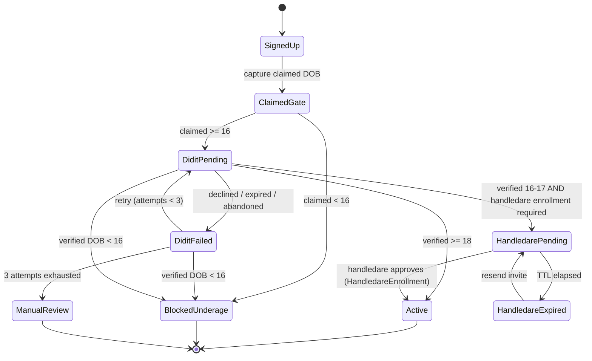

# Learner Verification Flow Map — DriveLinkUp

## Contents

- [0. Config](#0-config)
- [1. The two DOB sources](#1-the-two-dob-sources-read-this-first)
- [2. State machine](#2-state-machine)
- [3. States](#3-states)
- [4. Transition rules](#4-transition-rules-exact-conditions)
- [5. Didit integration contract](#5-didit-integration-contract)
- [6. Route guards](#6-route-guards)
- [7. Page render matrix](#7-page-render-matrix--use-this-to-fix-the-page)
- [8. Edge cases](#8-edge-cases-cursor-must-handle)
- [9. Cursor prompt](#9-cursor-prompt)
- [Reference implementation](#reference-implementation)

## 0. Config

Sweden-first (ADR-001). Adult-supervisor flow is **HandledareEnrollment**
(Trafikverket-oriented), not parental guardian consent.

```text
MINIMUM_AGE = 16
HANDLEDARE_ENROLLMENT_REQUIRED = true   // when product rules require enrollment for 16–17
HANDLEDARE_ENROLLMENT_CEILING = 18
DIDIT_MAX_ATTEMPTS = 3
HANDLEDARE_ENROLLMENT_TTL_HOURS = 168   // 7 days
DIDIT_WORKFLOW_ID = "<age_and_identity>"  // supplied by Didit skill

// App routes (live — do not invent /learner/*)
STUDENT_DASHBOARD = /dashboard/student
ONBOARDING_VERIFY = /signup  // or future (onboarding) leaves; not /onboarding/learner yet
HANDLEDARE_APPROVE = /handledare/[token]  // src/app/(onboarding)/handledare/[token]/page.tsx
```

## 1. The two DOB sources (read this first)

| Source | Where it comes from | Trust | Used for |
| --- | --- | --- | --- |
| Claimed DOB | Signup form input | Untrusted | Routing only — decides whether to start Didit |
| Verified DOB | Didit webhook payload (parsed from ID document) | Authoritative | Final gate — decides the account's real state |

The age gate runs twice. Never write to `learnerProfile.ageVerified` from the form. Only Didit's webhook can set it.

## 2. State machine



## 3. States

| State | Can browse | Can book | Route (`stateToRoute`, Phase 0 soft-gate) |
| --- | --- | --- | --- |
| `SIGNED_UP` | yes | no | `/dashboard/student` (banner; TODO → `/onboarding/learner`) |
| `BLOCKED_UNDERAGE` | yes | no | `/signup?blocked=underage` |
| `DIDIT_PENDING` | yes | no | `/dashboard/student` (banner-driven) |
| `DIDIT_FAILED` | yes | no | `/dashboard/student` (banner-driven) |
| `MANUAL_REVIEW` | yes | no | `/dashboard/student` (banner-driven) |
| `HANDLEDARE_PENDING` | yes | no | `/dashboard/student` (banner-driven) |
| `HANDLEDARE_EXPIRED` | yes | no | `/dashboard/student` (banner-driven) |
| `ACTIVE` | yes | yes | `/dashboard/student` |
| `SUSPENDED` | yes | no | `/signup?blocked=suspended` |

## 4. Transition rules (exact conditions)

```text
T1  SIGNED_UP         → BLOCKED_UNDERAGE   when claimedDob age < 16
T2  SIGNED_UP         → DIDIT_PENDING      when claimedDob age >= 16
T3  DIDIT_PENDING     → BLOCKED_UNDERAGE   when didit.decision = approved AND verifiedAge < 16
T4  DIDIT_PENDING     → HANDLEDARE_PENDING when didit.decision = approved AND 16 <= verifiedAge < 18 AND HANDLEDARE_ENROLLMENT_REQUIRED
T5  DIDIT_PENDING     → ACTIVE             when didit.decision = approved AND verifiedAge >= 18
T6  DIDIT_PENDING     → DIDIT_FAILED       when didit.decision IN (declined, expired, abandoned)
T7  DIDIT_FAILED      → DIDIT_PENDING      when attempts < 3 AND user clicks retry
T8  DIDIT_FAILED      → MANUAL_REVIEW      when attempts >= 3
T9  HANDLEDARE_PENDING → ACTIVE            when HandledareEnrollment.status = APPROVED
T10 HANDLEDARE_PENDING → HANDLEDARE_EXPIRED when now > HandledareEnrollment.expiresAt
T11 HANDLEDARE_EXPIRED → HANDLEDARE_PENDING when user resends invite
```

Age calculation: use date-only comparison, not timestamp. `age = years between dob and today`. A learner who turns 16 today is eligible.

## 5. Didit integration contract

When to create the session: immediately after T2 (claimed DOB ≥ 16), server-side only.

Session payload (server → Didit):

```text
{
  workflow_id: DIDIT_WORKFLOW_ID,
  vendor_data: "<userId>",          // idempotency + webhook correlation
  callback: "<appUrl>/api/webhooks/didit",
  metadata: { role: "LEARNER", claimedDob: "<iso date>" }
}
```

Webhook handler (`/api/webhooks/didit`) must:

1. Verify signature (per Didit skill).
2. Read `vendor_data` → resolve `userId`.
3. Read `decision` — one of `approved | declined | in_review | expired | abandoned`.
4. On `approved`, extract:
   - `date_of_birth` (authoritative — write to `learnerProfile.dateOfBirthVerified`)
   - `first_name`, `last_name`, `document_type`, `document_number`, `nationality`
   - `liveness_passed`
5. Recompute age from `date_of_birth` → apply T3 / T4 / T5.
6. Write a `VerificationEvent` row (`subjectType: LEARNER`).
7. Do not trust `metadata.claimedDob` for gating — it is only used to detect mismatches (see §8).

Never call the age gate from the client. Always server-side, always from webhook data.

> **Note (2026-09-27):** Age is verified from ID documents, never from facial
> estimation. Facial estimation deprecated 2026-09-27; signup no longer calls
> `/api/signup/age-check`. Authoritative DOB is
> `decision.id_verifications[].date_of_birth` from the Free KYC webhook.

## 6. Route guards

Do **not** add `middleware.ts`. Use:

1. `proxy.ts` only for edge CSP / optional `middleware_chain` slot contributions.
2. Server Component / API guards: extend `requireDashboardSession` /
   `requireSignupPrerequisites` (`src/lib/dashboard-guard.ts`,
   `src/lib/signup-resume.ts`) to call `resolveLearnerState()` once it exists.

```ts
// Conceptual — live dashboards are /dashboard/student|instructor|handledare
const STUDENT_BOOKING_GATES = ["/dashboard/student/bookings"] // tighten as booking UX grows

// Inside requireSignupPrerequisites / dashboard layout for STUDENT:
const s = resolveLearnerState({ ...factsFromUserProfileAndEnrollment })
if (s !== "ACTIVE" && wantsBookingSurface) {
  redirect(stateToRoute(s)) // → /signup or onboarding leaves, never invent /learner/*
}
if (s === "ACTIVE" && onSignupOnlySurface) {
  redirect("/dashboard/student")
}

function stateToRoute(s) {
  switch (s) {
    // TODO: Move SIGNED_UP to /onboarding/learner when that route ships.
    case "SIGNED_UP":
    case "DIDIT_PENDING":
    case "DIDIT_FAILED":
    case "MANUAL_REVIEW":
    case "HANDLEDARE_PENDING":
    case "HANDLEDARE_EXPIRED":
    case "ACTIVE":
      return "/dashboard/student"
    case "BLOCKED_UNDERAGE":
      return "/signup?blocked=underage"
    case "SUSPENDED":
      return "/signup?blocked=suspended"
  }
}
```

Handledare **approval** (token link, T9): `src/app/(onboarding)/handledare/[token]/page.tsx`
— not under `/dashboard`.

## 7. Page render matrix — use this to fix the page

One page (`/onboarding/learner`) switching on `verificationState`:

| State | Headline | Body | Primary CTA | Secondary |
| --- | --- | --- | --- | --- |
| `SIGNED_UP` | "Let's get you verified" | "We need to confirm your age and identity before you can book lessons." | Verify with Didit → `POST /api/didit/session` | — |
| `DIDIT_PENDING` | "Verification in progress" | "This usually takes under 2 minutes. Don't close this tab." | (embedded Didit iframe or disabled button) | "Having trouble?" |
| `DIDIT_FAILED` | "We couldn't verify you" | "Reason: {didit.reason}. You can try again ({attempts}/3)." | Try again | "Contact support" |
| `MANUAL_REVIEW` | "Under review" | "Our team is reviewing your verification. We'll email you within 24h." | — | "Contact support" |
| `BLOCKED_UNDERAGE` | "You must be 16 or older" | "You'll be able to sign up on your 16th birthday." | — | "Why?" → tooltip |
| `HANDLEDARE_PENDING` | "Waiting for your handledare" | "We emailed {handledareEmail}. They need to approve enrollment before you can book." | Resend invite | "Change handledare email" |
| `HANDLEDARE_EXPIRED` | "Invite expired" | "The approval link expired. Send a new one?" | Resend invite | "Change handledare email" |
| `ACTIVE` | — | (redirect to `/dashboard/student`) | — | — |

## 8. Edge cases Cursor must handle

| Case | Required behaviour |
| --- | --- |
| Claimed DOB ≠ verified DOB | Log a `VerificationEvent` with both values. Proceed with verified DOB. If mismatch > 1 year, flag for review instead of auto-approving. |
| User under 16 lies and enters 16+ | Didit returns real DOB → T3 → `BLOCKED_UNDERAGE`. Do not silently allow. |
| Learner turns 16 tomorrow | Blocked today, eligible tomorrow. `BLOCKED_UNDERAGE` page should show "You'll be able to sign up on {date}". |
| Learner is 17, turns 18 during handledare enrollment | Re-check verified age on every webhook. Once ≥ 18, skip handledare → `ACTIVE`. |
| Didit session abandoned | Treat as `DIDIT_FAILED` after webhook timeout (30 min). Count toward 3 attempts. |
| Webhook arrives twice | Idempotent — dedupe on `didit.sessionId`. Never double-increment attempts. |
| Webhook arrives for unknown `vendor_data` | 200 OK, log to dead-letter, alert. |
| Handledare approves after expiry | Reject — token expired. Prompt learner to resend. |
| Handledare revokes later | `ACTIVE` → `SUSPENDED`; existing bookings honoured, no new bookings. |
| Learner changes claimed DOB after submit | Lock the field once `verificationState != SIGNED_UP`. |

## 9. Cursor prompt

Paste this alongside the file:

> Implement the learner verification flow exactly as specified in `@docs/learner-verification-flow.md`.
>
> Critical constraints:
>
> 1. There are two DOB sources. Claimed DOB (from form) is untrusted and used only for routing. Verified DOB (from Didit webhook) is authoritative and is the only source that can set `verificationState`.
> 2. The age gate runs twice — on claimed DOB at T1/T2, and on verified DOB at T3/T4/T5.
> 3. Age is computed with date-only comparison, not timestamps.
> 4. Webhook handler is idempotent on `didit.sessionId`.
> 5. Prefer one signup/onboarding surface that switches on `verificationState` (render matrix). Do not invent `/learner/*` dashboards — use `/dashboard/student`.
> 6. Route guards live in `proxy.ts` (edge only) and/or `requireDashboardSession` / `requireSignupPrerequisites` — never `middleware.ts`. Redirect with `stateToRoute()`.
> 7. Never call Didit from the client. Session creation is server-side only.
> 8. Handledare approval is `HandledareEnrollment` at `(onboarding)/handledare/[token]` (T9), not parental guardian consent.

Two things worth checking, because they're the usual culprits when the agent doesn't follow the two-DOB rule:

- The existing page is probably branching on claimed DOB only. Search the codebase for `dateOfBirth` and confirm it is not being read from the signup form in a route guard or booking check.
- The Didit webhook may be writing to the wrong field. If it updates `user.dateOfBirth` instead of `learnerProfile.dateOfBirthVerified`, the gate never sees the authoritative value and the two sources collapse into one.

---

# Reference implementation

## 1. `lib/verification/age.ts`

Date-only age calculation. Never uses timestamps.

```ts
/**
 * Age in whole years, computed on UTC calendar dates.
 * A learner who turns 16 today is 16 — not 15.
 */
export function ageInYears(dob: Date, today: Date = new Date()): number {
  const d = new Date(Date.UTC(dob.getUTCFullYear(), dob.getUTCMonth(), dob.getUTCDate()))
  const t = new Date(Date.UTC(today.getUTCFullYear(), today.getUTCMonth(), today.getUTCDate()))

  let age = t.getUTCFullYear() - d.getUTCFullYear()
  const monthDelta = t.getUTCMonth() - d.getUTCMonth()
  if (monthDelta < 0 || (monthDelta === 0 && t.getUTCDate() < d.getUTCDate())) {
    age--
  }
  return age
}

/** Date the learner turns `targetAge`. Used to render "sign up on {date}". */
export function dateTurningAge(dob: Date, targetAge: number): Date {
  const d = new Date(Date.UTC(dob.getUTCFullYear() + targetAge, dob.getUTCMonth(), dob.getUTCDate()))
  return d
}

export const MINIMUM_AGE = 16
export const GUARDIAN_CEILING_AGE = 18
```

## 2. `lib/verification/state.ts`

Pure state resolution. No DB, no I/O — trivially unit-testable.

```ts
import { ageInYears, MINIMUM_AGE, GUARDIAN_CEILING_AGE } from "./age"

export type LearnerVerificationState =
  | "SIGNED_UP"
  | "BLOCKED_UNDERAGE"
  | "DIDIT_PENDING"
  | "DIDIT_FAILED"
  | "MANUAL_REVIEW"
  | "GUARDIAN_PENDING"
  | "GUARDIAN_EXPIRED"
  | "ACTIVE"
  | "SUSPENDED"

export type DiditDecision =
  | "approved"
  | "declined"
  | "in_review"
  | "expired"
  | "abandoned"

export interface GuardianConsentSnapshot {
  status: "PENDING" | "APPROVED" | "REVOKED"
  expiresAt: Date
}

export interface ResolveInput {
  /** Current persisted state, used only as a tie-breaker for terminal states. */
  currentState: LearnerVerificationState
  /** Untrusted DOB from the signup form. Routing only. */
  claimedDob?: Date | null
  /** Authoritative DOB from Didit. The only source that can gate on age. */
  verifiedDob?: Date | null
  /** Latest decision from Didit. Null if no session has completed yet. */
  diditDecision?: DiditDecision | null
  /** Number of completed Didit attempts (declined/expired/abandoned). */
  diditAttempts: number
  /** Current guardian consent record, if any. */
  guardianConsent?: GuardianConsentSnapshot | null
  /** Injectable clock for tests. */
  now?: Date
}

export const DIDIT_MAX_ATTEMPTS = 3

/**
 * Resolves the next state from first principles rather than "transitioning".
 * This makes webhook replays and out-of-order delivery safe: calling it twice
 * with the same inputs always yields the same output.
 *
 * Transition rules T1–T11 from the flow map are implemented in priority order
 * below.
 */
export function resolveLearnerState(input: ResolveInput): LearnerVerificationState {
  const now = input.now ?? new Date()

  // Terminal: admin suspension outranks everything.
  if (input.currentState === "SUSPENDED") return "SUSPENDED"

  // ---- Verified DOB is authoritative. Gate on it first. ----
  if (input.verifiedDob) {
    const verifiedAge = ageInYears(input.verifiedDob, now)

    // T3
    if (verifiedAge < MINIMUM_AGE) {
      return "BLOCKED_UNDERAGE"
    }

    // T5 / T4 — only apply once Didit has actually approved.
    if (input.diditDecision === "approved") {
      if (verifiedAge >= GUARDIAN_CEILING_AGE) {
        return "ACTIVE"
      }

      // 16 <= verifiedAge < 18 → guardian gate
      const consent = input.guardianConsent
      if (consent?.status === "APPROVED") return "ACTIVE"
      if (consent?.status === "REVOKED") return "GUARDIAN_PENDING"
      if (consent && consent.expiresAt.getTime() < now.getTime()) {
        return "GUARDIAN_EXPIRED"
      }
      return "GUARDIAN_PENDING"
    }
  }

  // ---- Didit outcomes that aren't approval. ----
  switch (input.diditDecision) {
    case "in_review":
      // T? — Didit is still processing.
      return "DIDIT_PENDING"

    case "declined":
    case "expired":
    case "abandoned":
      // T8 / T6
      return input.diditAttempts >= DIDIT_MAX_ATTEMPTS
        ? "MANUAL_REVIEW"
        : "DIDIT_FAILED"

    default:
      break
  }

  // ---- No verified DOB yet. Fall back to the claimed DOB for routing. ----
  if (input.claimedDob) {
    const claimedAge = ageInYears(input.claimedDob, now)

    // T1
    if (claimedAge < MINIMUM_AGE) return "BLOCKED_UNDERAGE"

    // T2 — eligible, needs to start Didit.
    return "SIGNED_UP"
  }

  return "SIGNED_UP"
}

/** Route for a given state. Phase 0 soft-gate — live impl in src/lib/verification/state.ts. */
export function stateToRoute(state: LearnerVerificationState): string {
  switch (state) {
    // TODO: Move to /onboarding/learner when that route ships.
    case "SIGNED_UP":
      return "/dashboard/student"
    case "BLOCKED_UNDERAGE":
      return "/signup?blocked=underage"
    case "SUSPENDED":
      return "/signup?blocked=suspended"
    case "DIDIT_PENDING":
    case "DIDIT_FAILED":
    case "MANUAL_REVIEW":
    case "HANDLEDARE_PENDING":
    case "HANDLEDARE_EXPIRED":
    case "ACTIVE":
      return "/dashboard/student"
  }
}
```

## 3. `lib/verification/didit.ts`

Signature verification and payload parsing. Everything Didit-specific lives here so you only have one file to touch when you confirm their schema.

```ts
import crypto from "node:crypto"

export const DIDIT_WEBHOOK_SECRET = process.env.DIDIT_WEBHOOK_SECRET!
export const DIDIT_API_KEY = process.env.DIDIT_API_KEY!
export const DIDIT_WORKFLOW_ID = process.env.DIDIT_WORKFLOW_ID!
export const DIDIT_API_BASE = process.env.DIDIT_API_BASE ?? "https://verification.didit.me"

/**
 * Verify the Didit webhook signature.
 *
 * ASSUMPTION: HMAC-SHA256 over the raw request body, hex-encoded, sent in
 * `x-didit-signature`. Confirm header name and encoding against Didit's docs
 * and adjust the two marked lines if different.
 */
export function verifyDiditSignature(rawBody: string, signatureHeader: string | null): boolean {
  if (!signatureHeader) return false

  const expected = crypto
    .createHmac("sha256", DIDIT_WEBHOOK_SECRET)
    .update(rawBody, "utf8")
    .digest("hex") // <- change to "base64" if Didit encodes that way

  const provided = signatureHeader.trim() // <- strip a "sha256=" prefix if present
  const a = Buffer.from(expected)
  const b = Buffer.from(provided)
  if (a.length !== b.length) return false
  return crypto.timingSafeEqual(a, b)
}

/**
 * Normalized view of a Didit webhook payload.
 * Adjust the field accessors in `parseDiditWebhook` if their schema differs.
 */
export interface ParsedDiditWebhook {
  sessionId: string
  vendorData: string          // we send userId here
  decision: "approved" | "declined" | "in_review" | "expired" | "abandoned"
  verifiedDob: Date | null
  firstName: string | null
  lastName: string | null
  documentType: string | null
  documentNumber: string | null
  nationality: string | null
  livenessPassed: boolean | null
  reason: string | null
}

export function parseDiditWebhook(payload: any): ParsedDiditWebhook {
  // The exact paths below are the ones to verify against Didit's docs.
  const session = payload?.session ?? payload
  const decision = String(session?.status ?? payload?.decision ?? "").toLowerCase()
  const dobRaw = session?.decision?.date_of_birth ?? session?.document?.date_of_birth ?? null

  return {
    sessionId: String(session?.session_id ?? session?.id ?? ""),
    vendorData: String(session?.vendor_data ?? ""),
    decision: normalizeDecision(decision),
    verifiedDob: dobRaw ? new Date(dobRaw) : null,
    firstName: session?.document?.first_name ?? session?.decision?.first_name ?? null,
    lastName: session?.document?.last_name ?? session?.decision?.last_name ?? null,
    documentType: session?.document?.document_type ?? null,
    documentNumber: session?.document?.document_number ?? null,
    nationality: session?.document?.nationality ?? null,
    livenessPassed: session?.liveness?.passed ?? session?.decision?.liveness_passed ?? null,
    reason: session?.decision?.reason ?? payload?.reason ?? null,
  }
}

function normalizeDecision(raw: string): ParsedDiditWebhook["decision"] {
  switch (raw) {
    case "approved":
    case "verified":
    case "success":
      return "approved"
    case "declined":
    case "rejected":
    case "failed":
      return "declined"
    case "in_review":
    case "pending":
    case "processing":
      return "in_review"
    case "expired":
      return "expired"
    case "abandoned":
    case "cancelled":
    case "canceled":
      return "abandoned"
    default:
      return "in_review"
  }
}

/** Create a Didit verification session. Server-side only. */
export async function createDiditSession(args: {
  userId: string
  claimedDob: Date | null
  callbackUrl: string
}): Promise<{ sessionId: string; url: string }> {
  const res = await fetch(`${DIDIT_API_BASE}/v2/session/`, {
    method: "POST",
    headers: {
      "Content-Type": "application/json",
      "x-api-key": DIDIT_API_KEY,
    },
    body: JSON.stringify({
      workflow_id: DIDIT_WORKFLOW_ID,
      vendor_data: args.userId,
      callback: args.callbackUrl,
      metadata: {
        role: "LEARNER",
        claimedDob: args.claimedDob?.toISOString().slice(0, 10) ?? null,
      },
    }),
  })

  if (!res.ok) {
    const text = await res.text()
    throw new Error(`Didit session creation failed: ${res.status} ${text}`)
  }

  const json = await res.json()
  return {
    sessionId: json.session_id ?? json.id,
    url: json.url ?? json.verification_url,
  }
}
```

## 4. `app/api/didit/session/route.ts`

Server action that starts the flow. Called from the `SIGNED_UP` state.

```ts
import { NextResponse } from "next/server"
import { auth } from "@/auth"
import { prisma } from "@/lib/prisma"
import { createDiditSession } from "@/lib/verification/didit"
import { resolveLearnerState } from "@/lib/verification/state"

export async function POST(req: Request) {
  const session = await auth()
  if (!session?.user?.id) {
    return NextResponse.json({ error: "unauthorized" }, { status: 401 })
  }

  const profile = await prisma.learnerProfile.findUnique({
    where: { userId: session.user.id },
  })
  if (!profile) {
    return NextResponse.json({ error: "no_learner_profile" }, { status: 404 })
  }

  // Recompute state server-side. Never trust a client hint.
  const state = resolveLearnerState({
    currentState: profile.verificationState,
    claimedDob: profile.dateOfBirthClaimed,
    verifiedDob: profile.dateOfBirthVerified,
    diditDecision: null,
    diditAttempts: profile.diditAttempts,
    guardianConsent: null,
  })

  if (state !== "SIGNED_UP") {
    return NextResponse.json({ error: "invalid_state", state }, { status: 409 })
  }

  const appUrl = process.env.NEXT_PUBLIC_APP_URL!
  const { sessionId, url } = await createDiditSession({
    userId: session.user.id,
    claimedDob: profile.dateOfBirthClaimed,
    callbackUrl: `${appUrl}/api/webhooks/didit`,
  })

  await prisma.$transaction([
    prisma.learnerProfile.update({
      where: { userId: session.user.id },
      data: {
        diditSessionId: sessionId,
        verificationState: "DIDIT_PENDING",
      },
    }),
    prisma.verificationEvent.create({
      data: {
        subjectType: "LEARNER",
        subjectId: session.user.id,
        fromStatus: "SIGNED_UP",
        toStatus: "DIDIT_PENDING",
        note: `Didit session ${sessionId} created`,
      },
    }),
  ])

  return NextResponse.json({ url })
}
```

## 5. `app/api/webhooks/didit/route.ts`

The handler itself. Idempotent, transactional, signature-verified.

```ts
import { NextResponse } from "next/server"
import crypto from "node:crypto"
import { prisma } from "@/lib/prisma"
import {
  verifyDiditSignature,
  parseDiditWebhook,
} from "@/lib/verification/didit"
import {
  resolveLearnerState,
  type DiditDecision,
} from "@/lib/verification/state"

export const runtime = "nodejs"

export async function POST(req: Request) {
  // 1. Raw body first — required for signature verification.
  const rawBody = await req.text()
  const signature = req.headers.get("x-didit-signature")

  if (!verifyDiditSignature(rawBody, signature)) {
    return NextResponse.json({ error: "invalid_signature" }, { status: 401 })
  }

  // 2. Parse.
  let parsed
  try {
    parsed = parseDiditWebhook(JSON.parse(rawBody))
  } catch {
    return NextResponse.json({ error: "invalid_json" }, { status: 400 })
  }

  if (!parsed.sessionId || !parsed.vendorData) {
    // Unknown shape — accept and dead-letter, don't 5xx Didit into retries.
    await prisma.webhookDeadLetter.create({
      data: { source: "didit", payload: rawBody },
    })
    return NextResponse.json({ ok: true, ignored: true })
  }

  // 3. Idempotency. Unique on (sessionId, decision). Replays are no-ops.
  const payloadHash = crypto.createHash("sha256").update(rawBody).digest("hex")

  try {
    await prisma.diditWebhookEvent.create({
      data: {
        diditSessionId: parsed.sessionId,
        decision: parsed.decision,
        payloadHash,
      },
    })
  } catch (e: any) {
    if (e?.code === "P2002") {
      // Already processed. 200 so Didit stops retrying.
      return NextResponse.json({ ok: true, duplicate: true })
    }
    throw e
  }

  // 4. Resolve the learner.
  const userId = parsed.vendorData
  const profile = await prisma.learnerProfile.findUnique({
    where: { userId },
    include: { guardianConsents: { orderBy: { createdAt: "desc" }, take: 1 } },
  })

  if (!profile) {
    await prisma.webhookDeadLetter.create({
      data: { source: "didit", payload: rawBody, note: `no profile for ${userId}` },
    })
    return NextResponse.json({ ok: true, ignored: true })
  }

  // 5. Compute the new state from first principles (idempotent).
  const consent = profile.guardianConsents[0]
  const diditDecision: DiditDecision | null = parsed.decision ?? null

  // Terminal failure decisions increment the attempt counter. approved and
  // in_review do not.
  const isFailedAttempt =
    diditDecision === "declined" ||
    diditDecision === "expired" ||
    diditDecision === "abandoned"

  const nextAttempts = isFailedAttempt
    ? profile.diditAttempts + 1
    : profile.diditAttempts

  const nextState = resolveLearnerState({
    currentState: profile.verificationState as any,
    claimedDob: profile.dateOfBirthClaimed,
    verifiedDob: parsed.verifiedDob ?? profile.dateOfBirthVerified,
    diditDecision,
    diditAttempts: nextAttempts,
    guardianConsent: consent
      ? { status: consent.status as any, expiresAt: consent.expiresAt }
      : null,
  })

  // 6. Persist in a transaction. Never write verified DOB from the client.
  await prisma.$transaction(async (tx) => {
    await tx.learnerProfile.update({
      where: { userId },
      data: {
        // Authoritative fields — only written here.
        ...(parsed.decision === "approved" && parsed.verifiedDob
          ? {
              dateOfBirthVerified: parsed.verifiedDob,
              firstNameVerified: parsed.firstName,
              lastNameVerified: parsed.lastName,
              documentType: parsed.documentType,
              documentNumber: parsed.documentNumber,
              nationality: parsed.nationality,
              livenessPassed: parsed.livenessPassed,
            }
          : {}),
        verificationState: nextState,
        diditAttempts: nextAttempts,
        diditLastDecision: diditDecision,
        diditLastReason: parsed.reason,
      },
    })

    // If we just moved into GUARDIAN_PENDING and no consent exists, create one.
    if (nextState === "GUARDIAN_PENDING" && !consent) {
      const token = crypto.randomBytes(32).toString("hex")
      const expiresAt = new Date(Date.now() + 7 * 24 * 60 * 60 * 1000)
      await tx.guardianConsent.create({
        data: {
          wardId: userId,
          guardianEmail: profile.guardianEmail ?? "",
          token,
          status: "PENDING",
          expiresAt,
        },
      })
      // TODO: enqueue guardian email here.
    }

    await tx.verificationEvent.create({
      data: {
        subjectType: "LEARNER",
        subjectId: userId,
        fromStatus: profile.verificationState,
        toStatus: nextState,
        note: `Didit decision=${parsed.decision} session=${parsed.sessionId}`,
        metadata: {
          claimedDob: profile.dateOfBirthClaimed?.toISOString() ?? null,
          verifiedDob: parsed.verifiedDob?.toISOString() ?? null,
          attempts: nextAttempts,
        },
      },
    })
  })

  return NextResponse.json({ ok: true, state: nextState })
}
```

Note on the stray import: the original draft imported `DIDIT_MAX_ATTEMPTS_UNUSED` from `didit.ts`. That import is omitted here. `DIDIT_MAX_ATTEMPTS` lives in `state.ts`.

## 6. Prisma additions

Add these to `schema.prisma` and run `prisma migrate dev`.

```prisma
model LearnerProfile {
  // ... existing fields
  verificationState     String   @default("SIGNED_UP")
  dateOfBirthClaimed    DateTime?
  dateOfBirthVerified   DateTime?
  firstNameVerified     String?
  lastNameVerified      String?
  documentType          String?
  documentNumber        String?
  nationality           String?
  livenessPassed        Boolean?
  diditSessionId        String?
  diditAttempts         Int      @default(0)
  diditLastDecision     String?
  diditLastReason       String?
  guardianEmail         String?
  guardianConsents      GuardianConsent[]
}

model GuardianConsent {
  id            String   @id @default(cuid())
  wardId        String
  guardianEmail String
  token         String   @unique
  status        String   @default("PENDING")
  expiresAt     DateTime
  approvedAt    DateTime?
  revokedAt     DateTime?
  createdAt     DateTime @default(now())

  @@index([wardId])
}

model DiditWebhookEvent {
  id             String   @id @default(cuid())
  diditSessionId String
  decision       String
  payloadHash    String
  receivedAt     DateTime @default(now())

  @@unique([diditSessionId, decision])
}

model WebhookDeadLetter {
  id         String   @id @default(cuid())
  source     String
  payload    String
  note       String?
  receivedAt DateTime @default(now())
}

model VerificationEvent {
  id          String   @id @default(cuid())
  subjectType String
  subjectId   String
  actorId     String?
  fromStatus  String?
  toStatus    String
  note        String?
  metadata    Json?
  createdAt   DateTime @default(now())

  @@index([subjectType, subjectId])
}
```

## 7. Env vars

```bash
DIDIT_API_KEY=...
DIDIT_WEBHOOK_SECRET=...
DIDIT_WORKFLOW_ID=...
DIDIT_API_BASE=https://verification.didit.me   # adjust to their real base
NEXT_PUBLIC_APP_URL=https://your-app.com
```

## Three things to verify against Didit's docs before shipping

1. **Signature header + encoding.** Assumed `x-didit-signature` with hex HMAC-SHA256 over the raw body. If they use base64 or a `sha256=` prefix, adjust the two marked lines in `verifyDiditSignature`.
2. **Payload shape.** The field paths in `parseDiditWebhook` (`session.status`, `session.document.date_of_birth`, etc.) are educated guesses. Point the parser at a real sandbox payload and fix the accessors — everything downstream stays unchanged.
3. **Decision vocabulary.** `verified` / `success` map to `approved`, and `rejected` / `failed` map to `declined`. Confirm their exact enum values.
